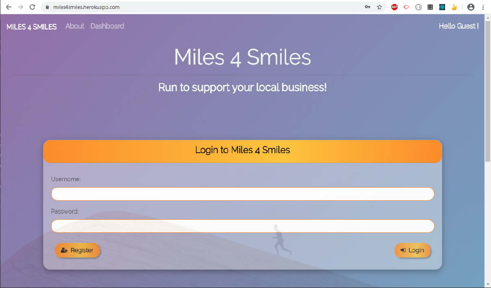

# Miles 4 Smiles

 

## Table of Content

*[User Story](#User)
*[Description](#Description)
*[Installation](#Installation)
*[Usage](#Usage)
*[Test](#Test)
*[Deployed Link](#Deployed)
*[Contribution](#Contribution)

## User Story

```
As an avid runner passionate about my local community
I want to track my races and compete against other runners
So that I can raise money for local businesses plus awareness for a healthy lifestyle
```

## Description

React Application that allows runners to connect, compete and create challenges that lead to donations to local businesses in their area.
In a period of economic lockdown and social isolation it can be difficult to find motivation to get out and be active. Especially during the Covid-19 pandemic, this application looks to promote a healthy lifestyle while also advocating for local businesses. Users can register to compete against other athletes where the slower runner donates a pledged amount to a selected business, in addition to just using the app to log their recent race paces.

## Installation

Git clone and run the following command:

```
    npm install
```

## Usage

```
    npm run start
```

## Deployed Link:

The heroku deployed link: <a href="https://miles4smiles.herokuapp.com/">Miles4Smiles</a>.



## Test:

```
    client/npm run test
```


## Contribution

Pull requests are welcome. Code of Conduct: Standard (Fork, Clone, Commit, Push and Create Pull requests).

## Credits

Background photo by Jeremy Lapak from Unsplash
About page photo by RUN 4 FFWPU from Pexels
Google Maps <a href="https://cloud.google.com/maps-platform/places/">Places</a> API

## Questions

If you have any questions about the repo, open an issue.

  
